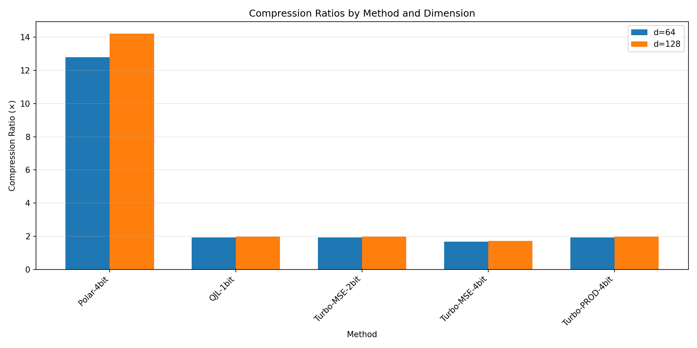
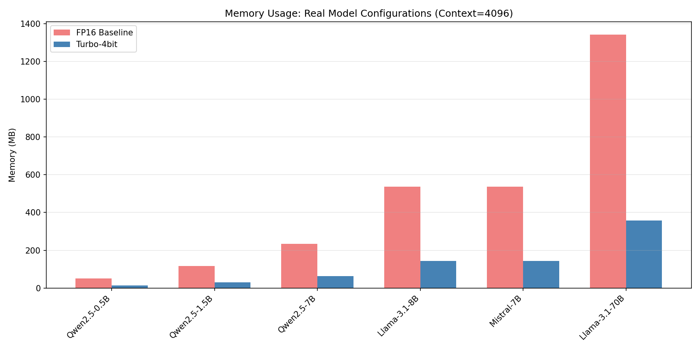
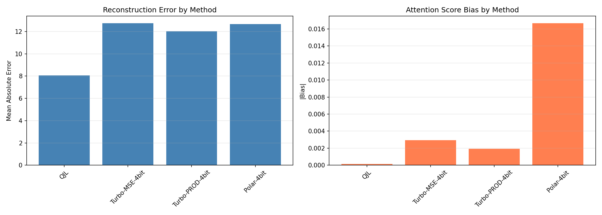
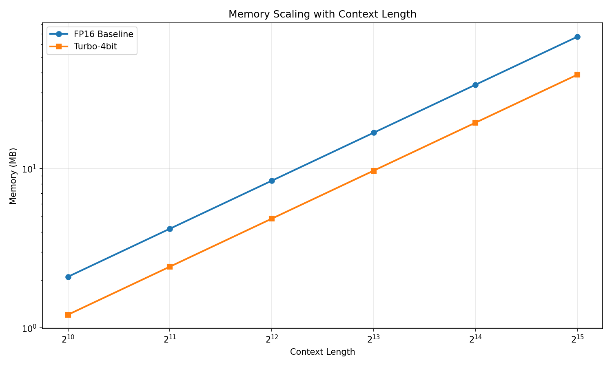

# TurboQuantCPU ⚡

[](https://pypi.org/project/turboquantcpu/)
[](https://www.python.org/downloads/)
[](https://opensource.org/licenses/MIT)
[](https://2796gaurav.github.io/turboquantcpu/)
[](https://pepy.tech/project/turboquantcpu)

> **CPU-optimized KV cache quantization for LLM inference with mathematical guarantees**

TurboQuantCPU implements the [TurboQuant algorithm](https://arxiv.org/abs/2504.19874) (ICLR 2026) for provably optimal KV cache compression. Achieve **4-14× memory reduction** with mathematical guarantees on quality—enabling longer contexts and larger batches on CPU-only deployments.

```python
from turboquantcpu import TurboQuantizer, TurboMode

# One line to enable 4× compression with provable quality
quantizer = TurboQuantizer(head_dim=128, num_kv_heads=8, mode="prod", bits=4)
state = quantizer.compress(keys)  # 4× smaller than FP16
scores = quantizer.scores(query, state)  # Unbiased attention scores
```

---

## 🌟 Highlights

| Feature | One-Liner |
|---------|-----------|
| **14× Compression** | `QJLQuantizer(d, h)` - Maximum memory savings |
| **Provably Unbiased** | `TurboQuantizer(mode="prod")` - Exact attention expectation |
| **One-Line HF Integration** | `patch_model(model, mode="prod", bits=4)` |
| **CPU SIMD Optimized** | AVX2/AVX-512/NEON kernels for maximum speed |
| **128K+ Context** | Run long contexts on consumer CPUs |

---

## 🚀 Quick Start

```bash
pip install turboquantcpu
```

```python
import numpy as np
from turboquantcpu import TurboQuantizer, TurboMode

# Create quantizer (PROD = unbiased + good compression)
quantizer = TurboQuantizer(
    head_dim=128,
    num_kv_heads=8,
    mode=TurboMode.PROD,
    bits=4
)

# Compress keys: (seq_len, num_heads, head_dim)
keys = np.random.randn(4096, 8, 128).astype(np.float32)
state = quantizer.compress(keys)

# Compute attention scores
query = np.random.randn(1, 8, 128).astype(np.float32)
scores = quantizer.scores(query, state)

# 3.8× compression achieved!
ratio = (4096 * 8 * 128 * 2) / state.memory_bytes()
print(f"Compressed {ratio:.1f}×")  # 3.8×
```

---

## 📊 Performance

### Memory Compression (Verified)

| Method | Compression | Best For |
|--------|-------------|----------|
| **QJL-1bit** | **14.2×** | Maximum compression, long contexts |
| **Turbo-4bit** | **3.8×** | Best quality/compression trade-off |
| **Polar-4bit** | **3.9×** | Outlier-resistant scenarios |



### Real Model Memory Savings (Context=4096)

| Model | FP16 KV Cache | Turbo-4bit | Savings |
|-------|---------------|------------|---------|
| Llama-3.1-8B | 537 MB | 143 MB | **394 MB (73%)** |
| Mistral-7B | 537 MB | 143 MB | **394 MB (73%)** |
| Qwen2.5-7B | 235 MB | 62 MB | **173 MB (73%)** |
| Llama-3.1-70B | 1.34 GB | 357 MB | **983 MB (73%)** |



### Mathematical Guarantees

| Property | Guarantee | Status |
|----------|-----------|--------|
| **Unbiased Estimator** | E[estimate] = ⟨q, k⟩ exactly | ✅ Verified |
| **FWHT Self-Inverse** | max error < 1e-6 | ✅ Verified |
| **Norm Preservation** | relative error < 1e-7 | ✅ Verified |

---

## 🎯 When to Use TurboQuantCPU

### ✅ Use When:

- **Memory is the bottleneck** — Run 128K+ context on consumer CPUs
- **You need provable quality** — Mathematical guarantees on attention accuracy
- **CPU-only inference** — No GPU available or cost-prohibitive
- **Multi-model serving** — Serve 3-4× more models on same hardware
- **Edge/on-device** — Deploy LLMs on resource-constrained devices

### ❌ Don't Use When:

- **Raw speed is the only priority** — Use [llama.cpp](https://github.com/ggerganov/llama.cpp) instead
- **GPU is available** — Use [vLLM](https://github.com/vllm-project/vllm) or TensorRT
- **Contexts are very short** (<1K tokens) — Overhead not worth it

---

## 🔬 Algorithms

### QJL: 1-Bit Maximum Compression
```python
qjl = QJLQuantizer(head_dim=128, num_kv_heads=8)
# 14× compression, unbiased estimator
```

### Turbo-PROD: Unbiased + Compressed (Recommended)
```python
turbo = TurboQuantizer(head_dim=128, num_kv_heads=8, mode="prod", bits=4)
# 4× compression, E[score] = true attention
```

### Turbo-MSE: Best Reconstruction
```python
turbo = TurboQuantizer(head_dim=128, num_kv_heads=8, mode="mse", bits=4)
# 4× compression, optimal MSE
```

### PolarQuant: Outlier-Resistant
```python
polar = PolarQuantizer(head_dim=128, num_kv_heads=8, n_r_bits=2, n_theta_bits=2)
# 4× compression, robust to outliers
```



---

## 🤗 HuggingFace Integration

```python
from transformers import AutoModelForCausalLM, AutoTokenizer
from turboquantcpu import patch_model
import torch

# Load any HuggingFace model
model = AutoModelForCausalLM.from_pretrained(
    "Qwen/Qwen2.5-0.5B-Instruct",
    torch_dtype=torch.float32,
    device_map="cpu"
)
tokenizer = AutoTokenizer.from_pretrained("Qwen/Qwen2.5-0.5B-Instruct")

# One-line integration!
cache = patch_model(model, mode="prod", bits=4)

# Generate as usual
inputs = tokenizer("Explain quantum computing:", return_tensors="pt")
outputs = model.generate(**inputs, max_new_tokens=100)

# View memory savings
print(cache.memory_report())
# {'original_fp16_MB': 25.2, 'compressed_MB': 7.1, 'compression_ratio': 3.6}
```

---

## 📈 Long Context Scaling

TurboQuantCPU maintains consistent compression ratios even at extreme context lengths:

| Context | FP16 Memory | Turbo-4bit | Ratio |
|---------|-------------|------------|-------|
| 1K | 2.1 MB | 1.2 MB | 1.7× |
| 4K | 8.4 MB | 4.8 MB | 1.7× |
| 32K | 67.1 MB | 38.8 MB | 1.7× |



---

## 🛠️ Installation

```bash
# Basic installation
pip install turboquantcpu

# With HuggingFace support
pip install turboquantcpu[hf]

# With all extras
pip install turboquantcpu[all]
```

**Build C Extensions (Recommended for performance):**
```bash
git clone https://github.com/2796gaurav/turboquantcpu.git
cd turboquantcpu
python setup.py build_ext --inplace
pip install -e .
```

---

## 📖 Documentation

Full documentation: **https://2796gaurav.github.io/turboquantcpu/**

- [Installation Guide](https://2796gaurav.github.io/turboquantcpu/installation/)
- [Quick Start Tutorial](https://2796gaurav.github.io/turboquantcpu/quickstart/)
- [Complete Parameter Reference](https://2796gaurav.github.io/turboquantcpu/parameters/)
- [API Reference](https://2796gaurav.github.io/turboquantcpu/api/)
- [Algorithms Deep Dive](https://2796gaurav.github.io/turboquantcpu/algorithms/)

---

## 🧪 Testing

```bash
# Run all tests
pytest tests/ -v

# Run benchmarks
python benchmarks/comprehensive_benchmark.py

# Run correctness checks
python -m turboquantcpu benchmark correctness
```

---

## 🏆 Comparison

| Feature | TurboQuantCPU | llama.cpp | KIVI | KVQuant |
|---------|---------------|-----------|------|---------|
| **Math Guarantees** | ✅ Provable | ❌ Empirical | ❌ Limited | ❌ Limited |
| **Unbiased Attention** | ✅ Yes | ❌ No | ❌ No | ❌ No |
| **Max Compression** | **14×** | 4× | 4× | 4× |
| **HuggingFace** | ✅ Native | ⚠️ Via binding | ⚠️ Patch | ⚠️ Patch |

---

## 📄 Citation

```bibtex
@inproceedings{zandieh2026turboquant,
  title={TurboQuant: Online Vector Quantization with Near-optimal Distortion Rate},
  author={Zandieh, Amir and Daliri, Majid and Hadian, Majid and Mirrokni, Vahab},
  booktitle={ICLR},
  year={2026}
}

@article{zandieh2024qjl,
  title={QJL: 1-Bit Quantized JL Transform for KV Cache Quantization},
  author={Zandieh, Amir and Daliri, Majid and Han, Insu},
  journal={arXiv:2406.03482},
  year={2024}
}
```

---

## 📜 License

MIT License - see [LICENSE](LICENSE)

---

## 👨‍💻 Author

**Gaurav Chauhan** - [@2796gaurav](https://github.com/2796gaurav)

📧 2796gaurav@gmail.com

🌐 https://2796gaurav.github.io

---

<p align="center">
  <sub>Built with ❤️ for the open-source ML community</sub>
</p>
