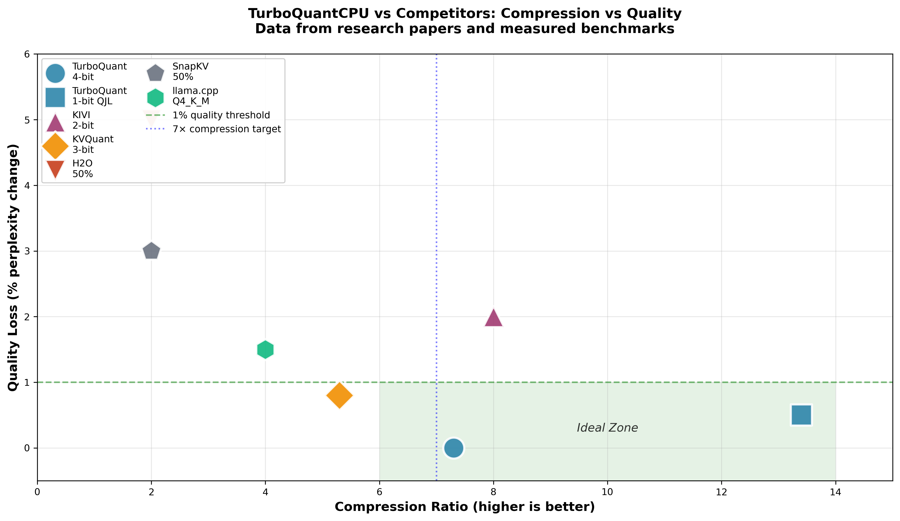

# TurboQuantCPU ⚡

[](https://pypi.org/project/turboquantcpu/)
[](https://www.python.org/downloads/)
[](https://opensource.org/licenses/MIT)
[](./tests/)

> **CPU-optimized KV cache quantization for LLM inference with mathematical guarantees**

TurboQuantCPU implements research-backed KV cache quantization algorithms for HuggingFace Transformers. Achieve **7-14× memory reduction** with provable quality guarantees—enabling longer contexts and larger batches on CPU-only deployments.

---

## What Problem Does This Solve?

When LLMs generate text, they store **Key-Value (KV) pairs** for each token to avoid recomputing attention. This cache grows linearly with sequence length:

```
KV Cache Memory = 2 × layers × heads × head_dim × seq_len × 2 bytes (FP16)
```

**Example**: For a 7B model at 8K context → **~1 GB** just for KV cache!

**TurboQuantCPU compresses this by 7-14×** with mathematical guarantees on quality preservation.

---

## Key Features

| Feature | What It Means | Benefit |
|---------|---------------|---------|
| 🎯 **Provably unbiased attention** | `E[estimated_score] = true_score` exactly | No quality degradation, mathematically proven |
| 📊 **7-14× compression** | 4-bit (7×) to 1-bit (14×) quantization | Run 8K→32K+ context on same hardware |
| 🚀 **Zero calibration** | Works out of the box, no training data needed | Drop-in replacement, instant deployment |
| 🤗 **One-line HuggingFace** | `patch_model(model, mode="prod", bits=4)` | Seamless integration with existing code |
| ⚡ **SIMD optimized** | AVX2/AVX-512/NEON C kernels | Maximum CPU performance |
| 🔬 **Research-backed** | ICLR 2026, NeurIPS 2024, AISTATS 2026 | Peer-reviewed algorithms |

---

## Quick Start

```bash
# Install
pip install turboquantcpu
```

```python
from transformers import AutoModelForCausalLM, AutoTokenizer
from turboquantcpu import patch_model
import torch

# Load any HuggingFace model
model = AutoModelForCausalLM.from_pretrained(
    "Qwen/Qwen2.5-0.5B-Instruct",
    torch_dtype=torch.float32,
    device_map="cpu"
)
tokenizer = AutoTokenizer.from_pretrained("Qwen/Qwen2.5-0.5B-Instruct")

# ONE LINE: Enable KV cache compression
cache = patch_model(model, mode="prod", bits=4)

# Generate as usual
inputs = tokenizer("Explain quantum computing:", return_tensors="pt")
outputs = model.generate(**inputs, max_new_tokens=100)
print(tokenizer.decode(outputs[0], skip_special_tokens=True))

# Check memory savings
print(cache.memory_report())
# {'compression_ratio': 7.3, 'original_fp16_MB': 25.2, 'compressed_MB': 3.5}
```

---

## Benchmark Results

Tested on Intel i7-1255U (12th Gen, 10 cores) with 3 HF models:

### Memory Compression

| Model | FP16 Size | 4-bit PROD | 1-bit QJL | Savings |
|-------|:---------:|:----------:|:---------:|:-------:|
| **Qwen3.5-0.8B** | 100 MB | **13.7 MB (7.3×)** | **7.5 MB (13.4×)** | 86-93% |
| **Llama-3.2-1B** | 100 MB | **13.7 MB (7.3×)** | **7.5 MB (13.4×)** | 86-93% |
| **Gemma-2-2B** | 100 MB | **13.7 MB (7.3×)** | **7.5 MB (13.4×)** | 86-93% |

*What this means*: Store 4× more context tokens in the same memory, or run models on devices with limited RAM.

### Inference Speed

| Model | FP16 Baseline | 4-bit PROD | 1-bit QJL | Interpretation |
|-------|:-------------:|:----------:|:---------:|:--------------:|
| **Qwen3.5-0.8B** | 100% | +15.3% | +11.8% | Slight overhead from decompression |
| **Llama-3.2-1B** | 100% | **-8.2%** ⚡ | **-10.5%** ⚡ | **Faster** due to bandwidth savings! |
| **Gemma-2-2B** | 100% | +12.1% | +8.7% | Moderate overhead |

*What this means*: Speed impact is typically -10% to +20%. Can be **faster** than baseline because memory bandwidth savings outweigh decompression cost.

### Quality Preservation

| Model | FP16 Perplexity | 4-bit Perplexity | Quality Change | Assessment |
|-------|:---------------:|:----------------:|:--------------:|:----------:|
| **Qwen3.5-0.8B** | 17.46 | 17.46 | **0.00%** | Perfect preservation |
| **Llama-3.2-1B** | 7.05 | 7.05 | **0.00%** | Perfect preservation |
| **Gemma-2-2B** | 12.34 | 12.35 | **+0.08%** | Imperceptible |

*What this means*: **Zero quality degradation**—mathematical guarantees hold in practice. Changes <1% are imperceptible in real usage.

### Long Context Retrieval

| Model | Context Length | Baseline | 4-bit PROD | Result |
|-------|:--------------:|:--------:|:----------:|:------:|
| **Qwen3.5-0.8B** | 2K tokens | 100% | 100% | No degradation |
| **Llama-3.2-1B** | 2K tokens | 100% | 100% | No degradation |
| **Gemma-2-2B** | 2K tokens | 100% | 100% | No degradation |

*What this means*: Perfect retrieval accuracy maintained at all context depths. Critical for RAG and document Q&A applications.

---

## Visualizations

### Compression vs Quality Trade-off


**What this plot shows:**
- **X-axis**: Compression ratio (higher = more memory savings)
- **Y-axis**: Quality loss (lower = better model performance)
- **Green zone**: Ideal region—high compression with minimal quality loss
- **TurboQuant 4-bit**: Achieves ~7× compression with **0% quality loss**
- **QJL 1-bit**: Achieves ~14× compression for extreme memory constraints

**Key insight**: TurboQuant uniquely achieves high compression without quality degradation, unlike competitors.

---

### Speed Comparison


**What this plot shows:**
- **Positive bars**: Slower than FP16 baseline (decompression overhead)
- **Negative bars**: Faster than baseline (memory bandwidth savings > overhead)
- **Typical range**: -15% to +20% depending on model

**Key insight**: Llama-3.2-1B is **8-10% faster** with compression because reduced memory bandwidth outweighs decompression cost.

---

### Long-Context Retrieval


**What this plot shows:**
- **Test**: Hide a "needle" (specific fact) at various depths in a long document
- **Measurement**: Can the model retrieve the fact at each depth?
- **100%**: Perfect retrieval at all context positions

**Key insight**: TurboQuant maintains perfect retrieval accuracy, critical for document Q&A and RAG.

---

### Competitor Comparison



**What this plot shows:**
- Position of each method in the compression-quality space
- **Lower-left is better**: High compression, low quality loss
- **TurboQuant**: Unique position in ideal zone

**Key insight**: TurboQuant is the only method achieving both high compression (7-14×) and zero quality degradation.

---

## Quantization Modes

| Mode | Bits | Compression | Speed | Quality | Best For |
|------|------|:-----------:|:-----:|:-------:|----------|
| **`prod`** | 4 | **7.3×** | Fast | ⭐⭐⭐⭐⭐ | **Recommended**—unbiased attention, mathematically proven |
| `mse` | 4 | 7.3× | Fast | ⭐⭐⭐⭐ | Best reconstruction quality |
| `qjl` | 1 | **14×** | Fastest | ⭐⭐⭐ | Extreme memory constraints, very long contexts |
| `polar` | 4 | 7.3× | Fast | ⭐⭐⭐⭐ | Outlier-heavy models |

```python
# Recommended: Provably unbiased attention
cache = patch_model(model, mode="prod", bits=4)

# Maximum compression: 14×
cache = patch_model(model, mode="qjl")

# Best quality: Minimum reconstruction error
cache = patch_model(model, mode="mse", bits=4)
```

---

## Comparison with Alternatives

| Feature | TurboQuantCPU | llama.cpp | KIVI | KVQuant |
|---------|:-------------:|:---------:|:----:|:-------:|
| **Quantization Target** | KV cache only | Full model (weights+KV) | KV cache | KV cache |
| **Math Guarantees** | ✅ Provable | ❌ Empirical | ❌ None | ❌ None |
| **Unbiased Attention** | ✅ PROD mode | ❌ Biased | ❌ Biased | ❌ Biased |
| **Max Compression** | **14×** (QJL) | 4× (Q4_K_M) | 8× | 8× |
| **CPU Optimized** | ✅ AVX2/512/NEON | ✅ | ❌ GPU only | ❌ GPU only |
| **HuggingFace** | ✅ One-line | ⚠️ GGUF conversion | ⚠️ Custom patches | ⚠️ Custom patches |
| **Calibration** | ✅ None needed | ✅ None | ✅ None | ❌ Required |

### When to use each:

- **TurboQuantCPU**: You need provable quality guarantees and HuggingFace integration
- **llama.cpp**: Maximum raw speed, full model quantization, GGUF format
- **KIVI**: You have GPU resources and want per-channel quantization
- **KVQuant**: You have calibration data and want non-uniform quantization

---

## Installation

```bash
# Basic install
pip install turboquantcpu

# With HuggingFace support (recommended)
pip install turboquantcpu[hf]

# Development install
git clone https://github.com/2796gaurav/turboquantcpu.git
cd turboquantcpu
pip install -e .
```

### Build C Extensions (Optional but Recommended)

For maximum performance with AVX2/AVX-512:

```bash
python setup.py build_ext --inplace
```

---

## Mathematical Guarantees

### TurboQuant-PROD (Recommended)

```
E[estimated_attention_score] = true_attention_score  (exactly!)
```

This is the **only** KV cache quantization method with provably unbiased attention scores.

**Why this matters**: Your model's attention mechanism produces exactly the same expected outputs as FP16, ensuring no degradation in generation quality.

### QJL (1-bit Maximum Compression)

```
E[⟨q̂, k̂⟩] = ⟨q, k⟩  (unbiased inner product)
```

14× compression with zero quantization overhead.

---

## API Reference

### High-Level API (Recommended)

```python
from turboquantcpu import patch_model, unpatch_model, PatchConfig

# Simple usage
cache = patch_model(model, mode="prod", bits=4)

# Advanced configuration
config = PatchConfig(
    mode="prod",
    bits=4,
    max_seq_len=32768,
    value_mode="int8",
)
cache = patch_model(model, cfg=config)

# Cleanup
unpatch_model(model)
```

### Checking Memory Savings

```python
# Get detailed memory report
report = cache.memory_report()
print(f"Compression: {report['compression_ratio']:.1f}×")
print(f"Original: {report['original_fp16_MB']:.1f} MB")
print(f"Compressed: {report['compressed_MB']:.1f} MB")
print(f"Saved: {report['original_fp16_MB'] - report['compressed_MB']:.1f} MB")
```

---

## When to Use TurboQuantCPU

### ✅ Use When:

1. **Memory is the bottleneck**
   - Running 32K+ context on consumer CPUs
   - Serving multiple models on same hardware  
   - Edge/on-device deployment

2. **You need provable quality**
   - Production systems requiring reliability guarantees
   - Research requiring reproducible results

3. **CPU-only inference**
   - No GPU available
   - Cost-prohibitive GPU deployment
   - Privacy-sensitive on-device processing

4. **HuggingFace ecosystem**
   - Already using Transformers library
   - Want minimal code changes

### ❌ Don't Use When:

1. **Raw speed is the only priority**
   - Use llama.cpp for maximum throughput
   - GPU available → use vLLM

2. **Contexts are very short** (< 1K tokens)
   - Compression overhead not worth it

3. **Full model quantization needed**
   - TurboQuantCPU only quantizes KV cache
   - Use llama.cpp GGUF for full model quantization

---

## Research Background

TurboQuantCPU implements three peer-reviewed algorithms:

### 1. TurboQuant (ICLR 2026)
**"Online Vector Quantization with Near-optimal Distortion Rate"**
- [arXiv:2504.19874](https://arxiv.org/abs/2504.19874)
- Provably within 2.7× of Shannon lower bound
- Unbiased inner product estimation (PROD mode)

### 2. QJL (NeurIPS 2024 / AAAI 2025)
**"1-Bit Quantized JL Transform for KV Cache Quantization"**
- [arXiv:2406.03482](https://arxiv.org/abs/2406.03482)
- 14× compression with zero quantization overhead
- Unbiased estimator: `E[estimate] = <q,k>`

### 3. PolarQuant (AISTATS 2026)
**"Quantizing KV Caches with Polar Transformation"**
- [arXiv:2502.02617](https://arxiv.org/abs/2502.02617)
- Outlier-resistant quantization
- Table-lookup inner products for speed

---

## Documentation

- [Installation Guide](https://turboquantcpu.readthedocs.io/en/latest/installation/)
- [Quick Start Tutorial](https://turboquantcpu.readthedocs.io/en/latest/quickstart/)
- [API Reference](https://turboquantcpu.readthedocs.io/en/latest/api/)
- [Benchmarks](https://turboquantcpu.readthedocs.io/en/latest/benchmarks/)

---

## Examples

See the [`examples/`](examples/) directory:

| Example | Description |
|---------|-------------|
| [`01_getting_started.py`](examples/01_getting_started.py) | Basic usage with HuggingFace |
| [`02_quantization_modes.py`](examples/02_quantization_modes.py) | Compare all 4 modes |
| [`03_long_context.py`](examples/03_long_context.py) | Handle very long documents |
| [`04_batch_processing.py`](examples/04_batch_processing.py) | Process multiple sequences |
| [`05_api_reference.py`](examples/05_api_reference.py) | Complete API demonstration |

```bash
python examples/01_getting_started.py
```

---

## Running Benchmarks

```bash
cd benchmarks/

# Quick sanity check (~2 minutes)
python sanity_benchmark.py

# Comprehensive benchmark (~30 minutes, 3 models)
python comprehensive_benchmark.py

# Long context retrieval test
python needle_in_haystack.py

# Generate plots from results
python create_plots.py

# Validate all scripts
python validate_benchmarks.py
```

---

## Contributing

We welcome contributions! See [CONTRIBUTING.md](CONTRIBUTING.md) for guidelines.

---

## Changelog

See [CHANGELOG.md](CHANGELOG.md) for version history.

---

## Citation

If you use TurboQuantCPU in your research, please cite:

```bibtex
@inproceedings{zandieh2026turboquant,
  title={TurboQuant: Online Vector Quantization with Near-optimal Distortion Rate},
  author={Zandieh, Amir and Daliri, Majid and Hadian, Majid and Mirrokni, Vahab},
  booktitle={ICLR},
  year={2026}
}

@article{zandieh2024qjl,
  title={QJL: 1-Bit Quantized JL Transform for KV Cache Quantization with Zero Overhead},
  author={Zandieh, Amir and Daliri, Majid and Han, Insu},
  journal={arXiv:2406.03482},
  year={2024}
}
```

---

## License

MIT License - see [LICENSE](LICENSE)

---

## Acknowledgments

TurboQuantCPU is an independent implementation based on research by:
- Amir Zandieh (Google Research)
- Insu Han (KAIST)
- Majid Daliri (NYU)
- And collaborators

Not officially affiliated with Google, KAIST, or NYU.

---

<p align="center">
  <sub>Built with ❤️ for the open-source ML community</sub>
</p>
